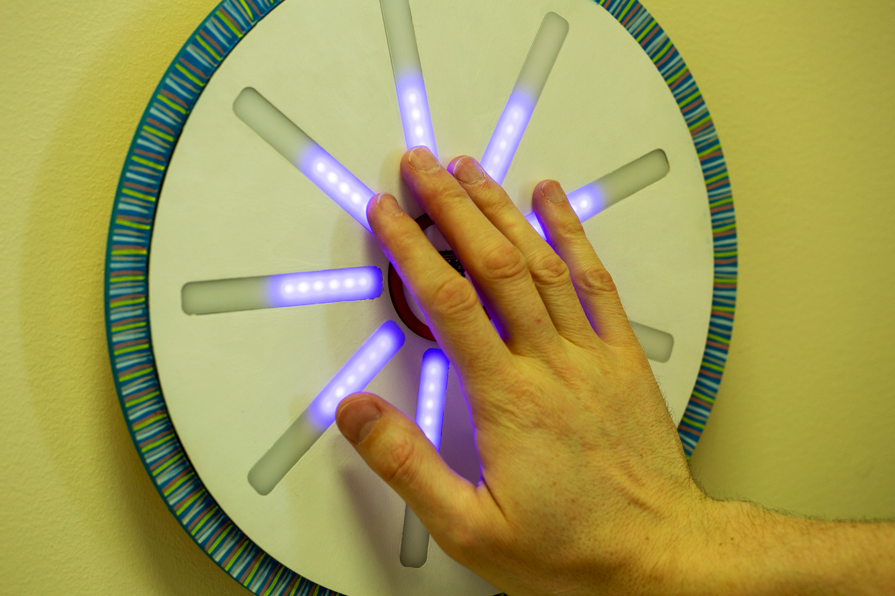
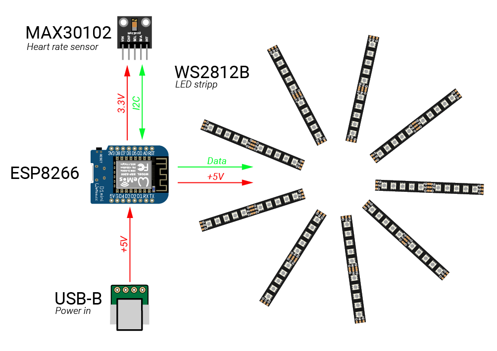
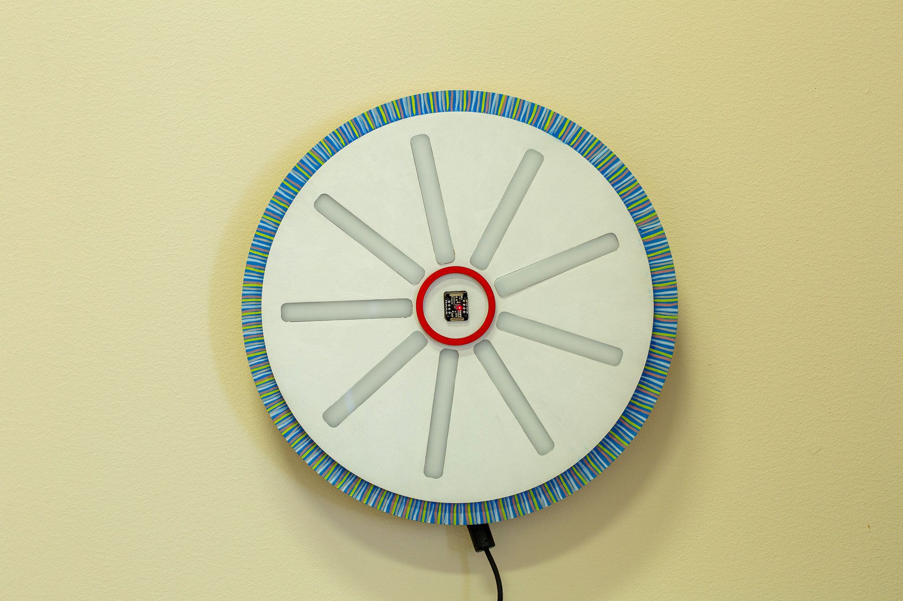

# PULSS

## Aura analüsaator ehk biovälja spektrograaf

Andur mõõdab kehalt tagasi peegelduvat infrapuna (IR) kiirgust ja arvutab selle järgi pulsi sageduse. Samuti amplituudi, kuna on rõhk kõige kõrgem ja madalam, mida kajastab vastavalt põlevate LEDide hulk. IR väärtustest arvutatakse ka LEDide värv.

- Lühike demo video [YouTubes](https://www.youtube.com/watch?v=Suh06js2dMg)

### Diagramm

______
Tauno Erik 2024
